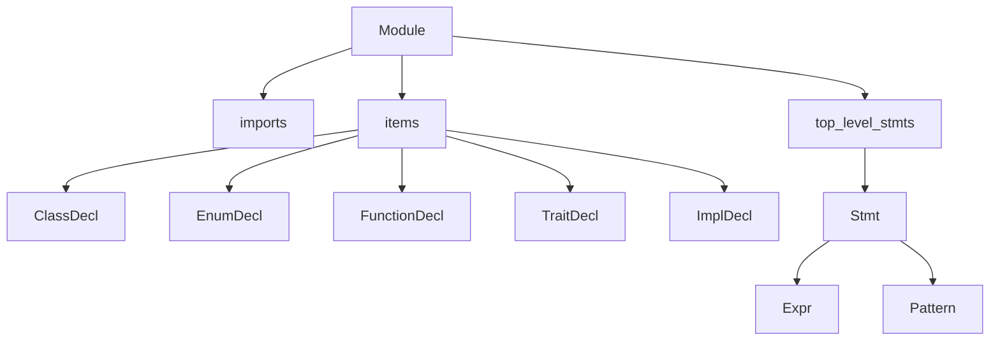

# AST And Source Model

Before you can understand Aura's parser or checker, you need to understand what shape of data they are building and consuming.

## What an AST is

An abstract syntax tree is a structured, in-memory representation of source code.

It is "abstract" because it keeps the meaning-bearing structure and drops most formatting details:

- it remembers that `a + b` is a binary expression
- it does not care whether you wrote one space or three spaces around `+`
- it remembers that a function has parameters, a return type, and a body
- it does not store the original comments as semantic nodes

Aura's AST is defined in [`ast.rs`](../crates/aura-compiler/src/ast.rs).

## Aura's source model

Aura source is organized around a top-level `Module`:

- imports
- items such as classes, enums, functions, traits, and impl blocks
- executable top-level statements

That means Aura can represent both:

- script-style files with top-level statements
- module-style files with declarations

The parser does not type-check anything yet. It only answers "what was written?".

## The main AST nodes

Aura's most important AST types are:

| Type | Purpose |
| --- | --- |
| `Module` | One source file: imports, items, top-level statements |
| `Item` | A top-level declaration such as `Class`, `Enum`, `Function`, `Trait`, or `Impl` |
| `Stmt` | A statement such as assignment, local `view`, `if`, `match`, `for`, `with`, `while`, `return`, or `break` |
| `Expr` | An expression such as a name, literal, call, member access, `match`, or `try` |
| `Pattern` | A `match` pattern such as a binding, wildcard, literal, or enum variant pattern |
| `TypeRef` | A syntactic type reference before semantic lowering |

The AST also carries `Span` values from [`diag.rs`](../crates/aura-compiler/src/diag.rs), which lets later stages report useful diagnostics.

## The tree shape



## Example: a tiny Aura program

Aura source:

```aura
def add(left: int32, right: int32) -> int32:
    return left + right

def main() -> int32:
    return add(20, 22)
```

At a high level, the AST looks like this:

- `Module`
  - `items`
    - `FunctionDecl(name = "add")`
      - params: `left`, `right`
      - return: `int32`
      - body
        - `ReturnStmt`
          - `ExprKind::Binary(Add, Name("left"), Name("right"))`
    - `FunctionDecl(name = "main")`
      - body
        - `ReturnStmt`
          - `ExprKind::Call(Name("add"), [20, 22])`

The AST knows the syntactic structure, but not yet:

- whether `add` exists when `main` calls it
- whether `left + right` is allowed for those types
- whether `main` is a valid entrypoint

Those questions belong to semantic analysis.

## How Aura models syntax choices

Aura uses enums heavily in the AST because language constructs branch into distinct cases.

Examples:

- `Item`
  This distinguishes class declarations from enum declarations and function declarations.
- `Stmt`
  This distinguishes `Return`, `If`, `For`, `While`, `Match`, `With`, and plain expression statements.
- `ExprKind`
  This distinguishes literals, names, unary operators, binary operators, calls, member access, indexing, casts, `try`, and expression-form `match`.

This is a common Rust compiler pattern: use algebraic data types to mirror language structure.

## Aura-specific AST decisions

There are a few choices worth calling out because they affect later stages:

- parameter and receiver passing modes
  The AST preserves whether an ordinary parameter was written with no
  modifier, `own`, or `mut`. Bare is logical shared access for every type;
  the eventual ABI may still pass copy bits directly. Receiver syntax is
  normalized to shared `self`, consuming `own self`, or mutable `mut self`.
- return contracts and local views
  `FunctionDecl` carries one `return_type` plus an optional `view_return`.
  When present, `view_return` records whether the returned view is mutable and
  names its receiver or parameter origin; otherwise the result is owned.
  `Stmt::View` separately records a local view binding's name, mutability, and
  source expression. A `ReturnStmt` records whether `return view` or
  `return view mut` was written.
- ownership modes on `match` and `for`
  A `for` statement preserves its bare, `own`, or `mut` capability so
  iterable-specific checking can resolve it. A `match` statement always has a
  normalized capability: bare is shared, `match own` consumes, and `match mut`
  grants mutable access.
- `top_level_stmts`
  Aura explicitly supports file-level execution, so the AST models it directly.
- `Specialize`
  Explicit type arguments such as `Box[int32](...)` get their own expression node.

## A tiny Rust model of an Aura-like AST

This example is intentionally much smaller than Aura's real AST, but it shows the basic idea.

```rust
#[derive(Debug)]
struct Module {
    items: Vec<Item>,
}

#[derive(Debug)]
enum Item {
    Function(FunctionDecl),
}

#[derive(Debug)]
struct FunctionDecl {
    name: String,
    params: Vec<Param>,
    body: Vec<Stmt>,
}

#[derive(Debug)]
struct Param {
    name: String,
    ty: TypeRef,
}

#[derive(Debug)]
enum Stmt {
    Return(Expr),
}

#[derive(Debug)]
enum Expr {
    Name(String),
    Int(i64),
    Binary {
        op: BinaryOp,
        left: Box<Expr>,
        right: Box<Expr>,
    },
    Call {
        callee: Box<Expr>,
        args: Vec<Expr>,
    },
}

#[derive(Debug)]
enum BinaryOp {
    Add,
}

#[derive(Debug)]
struct TypeRef {
    name: String,
}
```

That is the central AST lesson:

- use Rust structs for fixed-shape nodes
- use Rust enums for "one of many syntax forms"
- store enough information for later passes
- do not mix syntax parsing with semantic checking

## Where Aura goes beyond the tiny example

Aura's real AST adds:

- spans for diagnostics
- imports and module structure
- classes, enums, traits, impls
- `match`, `with`, and shared/mutable control-flow forms
- generics and trait bounds
- f-strings and map/set/list literals
- bare shared, `mut`, and `own` callable capabilities plus owned and
  `-> view [mut] T from origin` return contracts
- local `Stmt::View` bindings and `FunctionDecl.view_return` provenance

## How this stage connects to the next one

The lexer creates tokens. The parser consumes those tokens to build the AST. Then `sema.rs` consumes the AST and turns it into a checked `Program`.

Read [03-lexer.md](03-lexer.md) and [04-parser.md](04-parser.md) next to see where this tree comes from.
