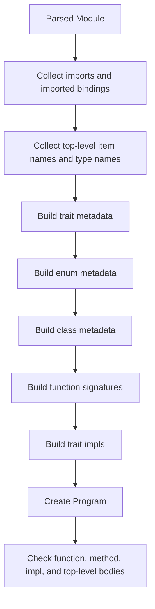

# Semantic Analysis

This chapter explains what semantic analysis is, what Aura's checker does, and how to build a small Aura-style type checker in Rust.

## What semantic analysis means

After parsing, you know the structure of the program, but not whether it makes sense.

Example:

```aura
return left + right
```

The parser can build this AST just fine. It does not know:

- whether `left` exists
- whether `right` exists
- whether they have compatible types
- whether `return` is allowed here

Semantic analysis is the stage that answers those questions.

## Aura's checked model: `Program`

Aura's checker lives in [`sema.rs`](../crates/aura-compiler/src/sema.rs). Its main output is `Program`.

`Program` contains:

- the original parsed `Module`
- module metadata such as `module_name` and `source_path`
- collected classes, enums, functions, traits, and trait impls
- imported module namespaces
- the module registry used for cross-module lookup
- the checked top-level statements

In other words, `Program` is Aura's typed semantic world model for one module and the names it can see.

## What Aura's checker actually does

Aura's semantic analysis is not one check. It is a layered pass.



Aura uses early collection phases so later checks can resolve forward references and cross-references.

## The main semantic data types

The most important checker data structures are:

| Type | Purpose |
| --- | --- |
| `Program` | The checked module plus semantic tables |
| `Type` | Aura's lowered semantic type model |
| `ClassInfo` / `EnumInfo` / `FunctionInfo` / `TraitInfo` | Collected semantic metadata |
| `ModuleNamespace` | Exported/imported module surface |
| `FunctionChecker` | The body checker for functions, methods, impl methods, and top-level blocks |

## Aura's semantic `Type`

Aura lowers syntactic `TypeRef` values into semantic `Type` values:

- `Type::Named(String, Vec<Type>)`
- `Type::TypeParam(String)`
- `Type::Module(String)`
- `Type::Unit`

This is where names like `Option[int32]` stop being raw syntax and become a semantic type.

## Checks Aura performs

Aura's checker covers more than "basic type checking". It performs:

- duplicate item detection
- type-parameter validation and arity checks
- visibility-aware import validation
- recursive-field validation and `indirect` enforcement
- `copy class` validation
- function and method signature construction
- default argument validation
- trait declaration and impl validation
- return checking
- expression typing
- move analysis and use-after-move detection
- mutable borrow exclusivity checks
- `match` typing and pattern binding
- top-level-vs-`main` execution rules

## Ownership and borrowing are semantic, not syntactic

Aura's syntax uses bare, `mut`, and `own` capabilities, which become
meaningful only after the checker validates the requested access or transfer.

Receiver syntax is normalized before body checking. Bare `self` installs a
shared binding, `own self` installs an owned binding and consumes a non-copy
receiver at the call boundary, and `mut self` installs an exclusive mutable
binding that requires a mutable receiver place. Trait and implementation
receiver matching compares these resolved modes.

Ordinary parameters keep their source mode until signature resolution. A bare
`value: T` is logical shared access for every type and remains
declaration-stable under specialization. The ABI may pass declaration-known
copy bits directly without changing that source contract. Explicit `own` and
`mut` select transfer and mutable access. Trait conformance and calls compare
the resolved capability, while hover and diagnostics retain enough source
information to teach the spelling that created it.

Loop ownership is resolved independently. Bare iteration over `list` and `set`
is shared, `own` consumes the collection, and `mut` supplies mutable
places only for collections that support writeback. Bare Queue iteration is a
receive operation: each received item is already owned by the loop binding and
the Queue handle is copyable, so all explicit loop ownership modifiers are
rejected. Bare matching is shared, `match own` consumes, and `match mut`
requires mutable access with writeback. Local assignment retains its ordinary
copy-or-move behavior.

Ordinary returns are owned. Copy results are ordinary copies. A non-copy result
must be constructed, cloned when clone-safe, moved from an owned input, or
produced through an owner operation. A declaration with
`-> view [mut] T from origin` is the explicit exception: it returns a
non-owning view whose origin is one receiver or parameter. The result may
initialize a matching `view` or `view mut` binding. A shared result may instead
be read directly within one containing expression, while a mutable result may
be immediately reborrowed into a `mut` call. It cannot enter an ordinary owned
binding or aggregate storage.

Aura's `FunctionChecker` tracks local bindings with information such as:

- semantic type
- whether the place is assignable
- whether it is a mutable place
- whether it came from a borrow
- whether it has been moved
- whether some fields have been partially moved

Places used by move, borrow, iteration-freeze, and mutable-match analysis have a canonical rooted representation: one binding root plus typed field projections. Relative projection paths are a separate type used only inside one binding's partial-move state. Keeping those types distinct prevents a relative field such as `state` from being compared accidentally with a rooted place such as `holder.state`.

That is why move and borrow diagnostics come from `sema.rs`, not the parser.

## Provisional task-boundary Transfer analysis

Phase 5.6 introduces the Accepted ADR-0033 design before Aura enables
multiple workers. `Transfer` is a compiler-derived structural property, not a
user trait. The checker must walk specialized collection, tuple, class, and
enum storage and retain a path to the first non-transferable leaf so a
diagnostic can explain why a captured argument or result cannot cross a task
boundary.

All copy types and `str` are transferable. Collections and user aggregates
are transferable when every stored component is; `Queue[T]` and `Task[T]`
handles are transferable because only handle identity, not stored payload,
crosses. Phase 5.7 synchronizes the runtime state behind those handles for
cross-worker use while every other admitted boundary value remains owned and
share-nothing.
Capability views, `random.Rng`, `TaskGroup`, and live host resources are not
transferable unless a later compiler-owned whitelist proves a particular type
safe. Reading a Copy value through shared or mutable access still produces an
owned snapshot; that snapshot may be captured when its type is Transfer. A
non-copy access cannot be materialized or transported this way. Phase 5.6
rejects an unresolved type parameter at a task or Queue
boundary rather than assuming it is transferable or exporting an inferred
Transfer obligation.

Owned host-result snapshots are classified by their stored data:
`process.Completed`, `net.HttpResponse`, and `net.UdpDatagram` are Transfer,
while their live Child, exchange, and socket sources are not. Queue payload
Transfer is checked by construction and `put`/`try_put`; handle-only operations
do not recheck the payload.

Task-start capture and result checks happen after callable specialization and
before scheduling. Result analysis also implements ADR-0008: only copy results
and `Queue[...]` or recursively repeatable `Task[...]` results are repeatable;
other transferable results have one observation right across all aliases and
wait helpers. Conservative consumption may produce zero values.

The task-target slot supports explicit `function[Types]` and
`Type.associated_method[Types]` specialization without changing ordinary
indexing elsewhere. Boundary failures use `AU3008`, duplication of a
single-consumer right uses `AU3009`, and reuse after a consuming observation
uses ordinary `AU3001`.

This section describes the implemented Provisional Phase 5.6 semantic
contract. Phase 5.7 uses it as the admission boundary for spawn-time pinned
workers on both backends: Queue and Task handles may communicate across
workers, while all other captures and results cross as owned `Transfer`
values. The semantic property does not by itself promise preemption, work
stealing, a scheduling order, or parallel speedup.

## A tiny Aura-like type checker in Rust

This toy example checks three things:

- names must exist
- `+` only works on integers
- `return` must match the function return type

```rust
use std::collections::HashMap;

#[derive(Debug, Clone, PartialEq)]
enum Type {
    Int,
    Unit,
}

#[derive(Debug)]
enum Expr {
    Name(String),
    Int(i64),
    Add(Box<Expr>, Box<Expr>),
}

#[derive(Debug)]
enum Stmt {
    Return(Expr),
}

fn type_of_expr(expr: &Expr, locals: &HashMap<String, Type>) -> Result<Type, String> {
    match expr {
        Expr::Name(name) => locals
            .get(name)
            .cloned()
            .ok_or_else(|| format!("unknown name `{}`", name)),
        Expr::Int(_) => Ok(Type::Int),
        Expr::Add(left, right) => {
            let left_ty = type_of_expr(left, locals)?;
            let right_ty = type_of_expr(right, locals)?;
            if left_ty == Type::Int && right_ty == Type::Int {
                Ok(Type::Int)
            } else {
                Err("`+` expects two integers".to_string())
            }
        }
    }
}

fn check_block(body: &[Stmt], locals: &HashMap<String, Type>, return_type: &Type) -> Result<(), String> {
    for stmt in body {
        match stmt {
            Stmt::Return(expr) => {
                let actual = type_of_expr(expr, locals)?;
                if &actual != return_type {
                    return Err(format!(
                        "return type mismatch: expected {:?}, found {:?}",
                        return_type, actual
                    ));
                }
            }
        }
    }
    Ok(())
}
```

This is obviously much smaller than Aura's real checker, but the pattern is the same:

- collect names into scopes
- walk statements and expressions
- assign semantic types
- emit diagnostics when meaning does not line up

## What makes Aura's checker interesting

### 1. It builds semantic tables before checking bodies

Aura can resolve many names because it first builds metadata tables for classes, enums, functions, traits, and impls.

### 2. It reuses call-binding logic

Named/positional argument binding is shared through [`call.rs`](../crates/aura-compiler/src/call.rs), so function calls and builtin calls follow the same argument-shape rules.

### 3. It treats builtin modules as namespaces

`io`, `fs`, and `net` are represented as module namespaces through [`builtin_modules.rs`](../crates/aura-compiler/src/builtin_modules.rs), which means import resolution and tooling can treat them similarly to ordinary modules.

### 4. It is the ownership gate

The checker is where Aura enforces:

- non-copy moves
- move-after-use and use-after-move
- borrow exclusivity
- receiver consumption and mutable-receiver requirements
- owned-return move and clone-safety constraints
- `with` resource requirements

### 5. It prepares later stages

MIR lowering does not want to rediscover the whole language's meaning. The checker gives it:

- resolved types
- validated control-flow surface
- validated trait and method shapes
- known module namespaces and imports

## Files to study after this chapter

- [`sema.rs`](../crates/aura-compiler/src/sema.rs)
- [`call.rs`](../crates/aura-compiler/src/call.rs)
- [`builtin_modules.rs`](../crates/aura-compiler/src/builtin_modules.rs)
- [`sema_tests.rs`](../crates/aura-compiler/src/sema_tests.rs)

## What comes next

After Aura has a checked `Program`, it lowers that model into MIR. Read [06-mir.md](06-mir.md).
