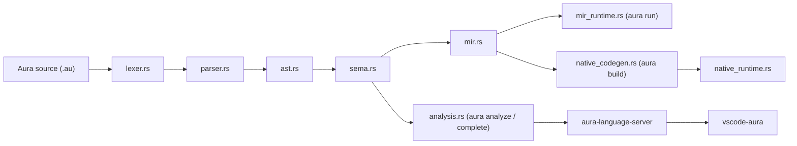

# Aura Architecture Docs

This folder is a guided architecture map for Aura as it exists in this repository today. It is written for two audiences at once:

- readers who want an accurate explanation of how the current implementation works
- readers who are new to compiler internals and need each stage explained from first principles

The docs are intentionally grounded in the actual source tree. When a chapter says "this is how Aura works", it points at the real implementation files, not an idealized design that only exists in a proposal.

## Reading order

1. [00-glossary.md](00-glossary.md)
2. [01-system-overview.md](01-system-overview.md)
3. [02-ast-and-source-model.md](02-ast-and-source-model.md)
4. [03-lexer.md](03-lexer.md)
5. [04-parser.md](04-parser.md)
6. [05-semantic-analysis.md](05-semantic-analysis.md)
7. [06-mir.md](06-mir.md)
8. [07-mir-runtime.md](07-mir-runtime.md)
9. [08-native-codegen-and-runtime.md](08-native-codegen-and-runtime.md)
10. [09-packages-and-module-loading.md](09-packages-and-module-loading.md)
11. [10-cli-and-build-tools.md](10-cli-and-build-tools.md)
12. [11-editor-tooling.md](11-editor-tooling.md)
13. [12-testing-and-quality.md](12-testing-and-quality.md)
14. [13-end-to-end-walkthrough.md](13-end-to-end-walkthrough.md)
15. [14-priority-roadmap.md](14-priority-roadmap.md)
16. [15-backend-boundary.md](15-backend-boundary.md)

Accepted language and runtime decisions are recorded separately in
[`decisions/`](decisions/README.md). The architecture chapters describe the
current implementation; an accepted decision can therefore precede its
implementation, and its ADR records the completion gate explicitly.

## Source anchors

The main implementation files these docs refer to are:

- [`crates/aura-compiler/src/lib.rs`](../crates/aura-compiler/src/lib.rs)
- [`crates/aura-compiler/src/lexer.rs`](../crates/aura-compiler/src/lexer.rs)
- [`crates/aura-compiler/src/parser.rs`](../crates/aura-compiler/src/parser.rs)
- [`crates/aura-compiler/src/ast.rs`](../crates/aura-compiler/src/ast.rs)
- [`crates/aura-compiler/src/sema.rs`](../crates/aura-compiler/src/sema.rs)
- [`crates/aura-compiler/src/mir.rs`](../crates/aura-compiler/src/mir.rs)
- [`crates/aura-compiler/src/mir_runtime.rs`](../crates/aura-compiler/src/mir_runtime.rs)
- [`crates/aura-compiler/src/runtime_value.rs`](../crates/aura-compiler/src/runtime_value.rs)
- [`crates/aura-compiler/src/native_codegen.rs`](../crates/aura-compiler/src/native_codegen.rs)
- [`crates/aura-compiler/src/native_runtime.rs`](../crates/aura-compiler/src/native_runtime.rs)
- [`crates/aura-compiler/src/package.rs`](../crates/aura-compiler/src/package.rs)
- [`crates/aura-compiler/src/analysis.rs`](../crates/aura-compiler/src/analysis.rs)
- [`crates/aura/src/main.rs`](../crates/aura/src/main.rs)
- [`tools/aura-language-server/src/server.js`](../tools/aura-language-server/src/server.js)
- [`tools/aura-language-server/src/compiler_bridge.js`](../tools/aura-language-server/src/compiler_bridge.js)
- [`tools/vscode-aura/src/extension.js`](../tools/vscode-aura/src/extension.js)

## What Aura is today

Aura is a language implementation monorepo. The current maintained execution architecture is:

- `aura run` parses, checks, lowers to MIR, and executes with the MIR runtime
- `aura build` parses, checks, lowers to MIR, lowers again into native code with Cranelift, and links against the direct runtime
- editor tooling prefers compiler-produced analysis and only falls back to local JavaScript analysis when it has to

These docs explain the maintained architecture implemented in this repository.
